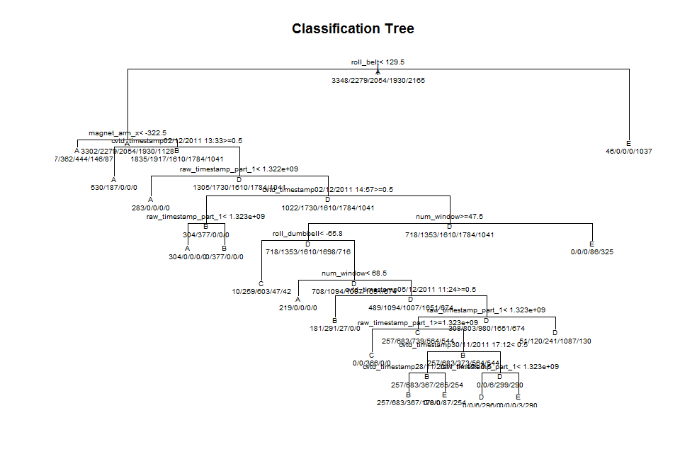

# Practical Machine Learning Project

#Introduction
In this project, the goal will be to use data from accelerometers on the belt, forearm, arm, and dumbell of 6 participants. They were asked to perform barbell lifts correctly and incorrectly in 5 different ways. The goal of the project is to predict the manner in which they did the exercise. The data for this project come from this source: http://groupware.les.inf.puc-rio.br/har. 

#Reading of Data

```r
traindata = read.csv("http://d396qusza40orc.cloudfront.net/predmachlearn/pml-training.csv")
testdata=read.csv("http://d396qusza40orc.cloudfront.net/predmachlearn/pml-testing.csv")
```

#Manipulation of Data
Remove index column and columns with NA.

```r
traindata=traindata[,c(2:11,37:49,60:68,84:86,160)]
testdata=testdata[,c(2:11,37:49,60:68,84:86)]
```

#Cross Validation
Partition the training data into 60% training and 40% testing for cross validation.

```r
set.seed(1753)
library(caret)
in.train <- createDataPartition(traindata$classe, p=0.60, list=FALSE)
train <- traindata[in.train,]
test <- traindata[-in.train,]
```

#Predicting with Tree

```r
modFitTree=train(classe~., method="rpart",data=train)
print(modFitTree)
```

```
## CART 
## 
## 11776 samples
##    35 predictor
##     5 classes: 'A', 'B', 'C', 'D', 'E' 
## 
## No pre-processing
## Resampling: Bootstrapped (25 reps) 
## 
## Summary of sample sizes: 11776, 11776, 11776, 11776, 11776, 11776, ... 
## 
## Resampling results across tuning parameters:
## 
##   cp          Accuracy   Kappa      Accuracy SD  Kappa SD  
##   0.02432368  0.6313679  0.5200995  0.13510328   0.19480637
##   0.02841718  0.5276818  0.3723622  0.14613992   0.21812364
##   0.11758424  0.3272548  0.0643859  0.04072021   0.06318972
## 
## Accuracy was used to select the optimal model using  the largest value.
## The final value used for the model was cp = 0.02432368.
```

```r
plot(modFitTree$finalModel,main="Classification Tree")
text(modFitTree$finalModel,use.n = T,all=T,cex=0.6)
```

 

```r
predictTree <- predict(modFitTree, newdata=test)
confusionMatrix(test$classe,predictTree)
```

```
## Confusion Matrix and Statistics
## 
##           Reference
## Prediction    A    B    C    D    E
##          A 1881  286    5   32   28
##          B  352  934  157   75    0
##          C  269  291  681  127    0
##          D  103  106   38  916  123
##          E   70    0   24   72 1276
## 
## Overall Statistics
##                                           
##                Accuracy : 0.725           
##                  95% CI : (0.7149, 0.7348)
##     No Information Rate : 0.3409          
##     P-Value [Acc > NIR] : < 2.2e-16       
##                                           
##                   Kappa : 0.6492          
##  Mcnemar's Test P-Value : NA              
## 
## Statistics by Class:
## 
##                      Class: A Class: B Class: C Class: D Class: E
## Sensitivity            0.7032   0.5776   0.7525   0.7496   0.8942
## Specificity            0.9321   0.9062   0.9010   0.9441   0.9741
## Pos Pred Value         0.8427   0.6153   0.4978   0.7123   0.8849
## Neg Pred Value         0.8586   0.8921   0.9654   0.9534   0.9764
## Prevalence             0.3409   0.2061   0.1153   0.1557   0.1819
## Detection Rate         0.2397   0.1190   0.0868   0.1167   0.1626
## Detection Prevalence   0.2845   0.1935   0.1744   0.1639   0.1838
## Balanced Accuracy      0.8176   0.7419   0.8268   0.8469   0.9342
```

#Predicting with Random Forest

```r
library(randomForest)
modFitRF=randomForest(classe~.,data=train)
predictRF=predict(modFitRF,newdata=test)
confusionMatrix(test$classe,predictRF)
```

```
## Confusion Matrix and Statistics
## 
##           Reference
## Prediction    A    B    C    D    E
##          A 2232    0    0    0    0
##          B    1 1515    2    0    0
##          C    0    1 1364    3    0
##          D    0    0    1 1285    0
##          E    0    0    0    0 1442
## 
## Overall Statistics
##                                          
##                Accuracy : 0.999          
##                  95% CI : (0.998, 0.9996)
##     No Information Rate : 0.2846         
##     P-Value [Acc > NIR] : < 2.2e-16      
##                                          
##                   Kappa : 0.9987         
##  Mcnemar's Test P-Value : NA             
## 
## Statistics by Class:
## 
##                      Class: A Class: B Class: C Class: D Class: E
## Sensitivity            0.9996   0.9993   0.9978   0.9977   1.0000
## Specificity            1.0000   0.9995   0.9994   0.9998   1.0000
## Pos Pred Value         1.0000   0.9980   0.9971   0.9992   1.0000
## Neg Pred Value         0.9998   0.9998   0.9995   0.9995   1.0000
## Prevalence             0.2846   0.1932   0.1742   0.1642   0.1838
## Detection Rate         0.2845   0.1931   0.1738   0.1638   0.1838
## Detection Prevalence   0.2845   0.1935   0.1744   0.1639   0.1838
## Balanced Accuracy      0.9998   0.9994   0.9986   0.9988   1.0000
```

#Conclusion
Looking at the confusion matrix and statistics, it is obvious that the random forest model is a much better prediction model with accuracy of 0.9987


